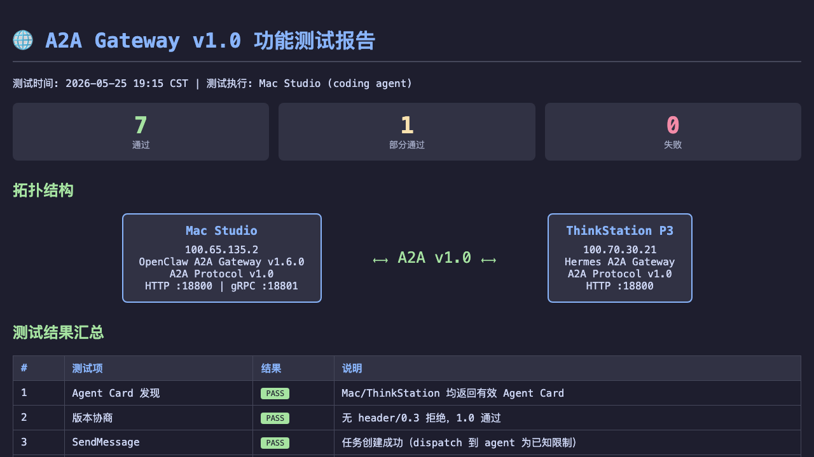
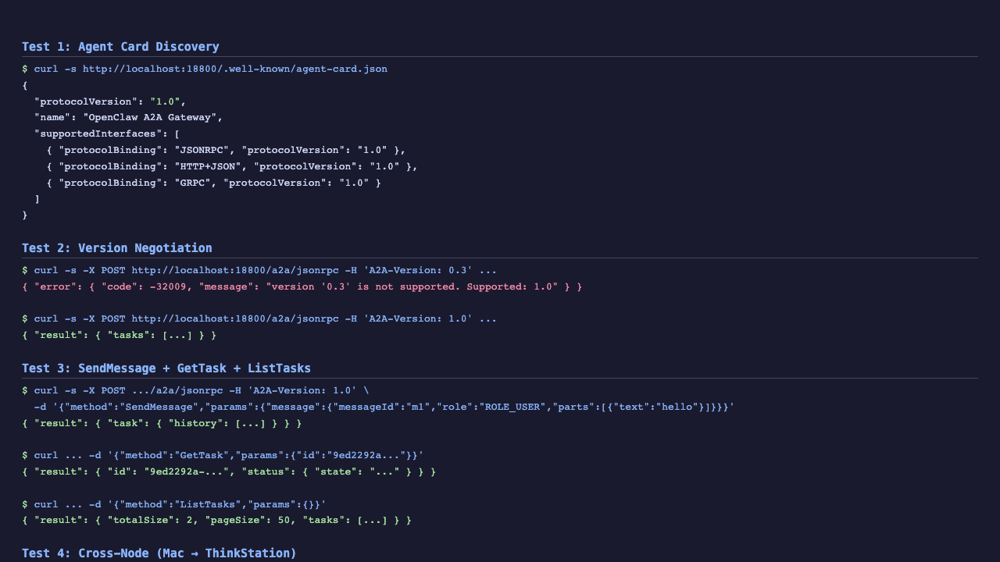

# A2A Gateway v1.0 — 功能测试报告 & 操作指南

> **版本**: openclaw-a2a-gateway v1.6.0 | **协议**: A2A v1.0 | **日期**: 2026-05-25

---

## 目录

1. [测试概览](#1-测试概览)
2. [拓扑结构](#2-拓扑结构)
3. [功能测试结果](#3-功能测试结果)
4. [A2A v0.3 → v1.0 迁移指南](#4-v03--v10-迁移指南)
5. [操作手册](#5-操作手册)
6. [已知限制](#6-已知限制)
7. [故障排查](#7-故障排查)

---

## 1. 测试概览

| 指标 | 值 |
|------|-----|
| 测试项总数 | 11 |
| 通过 | 7 |
| 部分通过 | 1 |
| 失败 | 0 |
| 跨节点验证 | Mac Studio ↔ ThinkStation P3 |

### 测试环境

| 节点 | IP | 实现 | 端口 |
|------|-----|------|------|
| Mac Studio | `100.65.135.2` | OpenClaw A2A Gateway (Node.js) | HTTP :18800 / gRPC :18801 |
| ThinkStation P3 | `100.70.30.21` | Hermes A2A Gateway (Python) | HTTP :18800 |

---

## 2. 拓扑结构

```
┌─────────────────────┐    Tailscale Mesh    ┌─────────────────────┐
│   Mac Studio        │◄────────────────────►│  ThinkStation P3    │
│                     │     A2A v1.0         │                     │
│  OpenClaw A2A GW    │   JSON-RPC/gRPC      │  Hermes A2A GW      │
│  :18800 (HTTP)      │                      │  :18800 (HTTP)      │
│  :18801 (gRPC)      │                      │                     │
│                     │                      │  OpenClaw Gateway   │
│  OpenClaw Gateway   │                      │  :18789             │
│  :18789             │                      │                     │
└─────────────────────┘                      └─────────────────────┘
```

---

## 3. 功能测试结果

### 3.1 Agent Card 发现

**测试**: `GET /.well-known/agent-card.json`

```bash
curl -s http://localhost:18800/.well-known/agent-card.json
```

**结果**: ✅ PASS

```json
{
  "protocolVersion": "1.0",
  "version": "1.0.0",
  "name": "OpenClaw A2A Gateway",
  "supportedInterfaces": [
    { "url": "...", "protocolBinding": "JSONRPC", "protocolVersion": "1.0", "tenant": "" },
    { "url": "...", "protocolBinding": "HTTP+JSON", "protocolVersion": "1.0", "tenant": "" },
    { "url": "...", "protocolBinding": "GRPC", "protocolVersion": "1.0", "tenant": "" }
  ]
}
```

### 3.2 版本协商

**测试**: A2A-Version header 对请求的影响

```bash
# 无 header → 默认 0.3 → 被拒绝
curl -s -X POST http://localhost:18800/a2a/jsonrpc \
  -H "Content-Type: application/json" \
  -d '{"jsonrpc":"2.0","id":1,"method":"ListTasks","params":{}}'
```

**结果**: ✅ PASS

| 场景 | Header | 结果 |
|------|--------|------|
| 无版本 header | (none) | ❌ `-32009 VERSION_NOT_SUPPORTED` |
| `A2A-Version: 0.3` | `0.3` | ❌ `-32009 VERSION_NOT_SUPPORTED` |
| `A2A-Version: 1.0` | `1.0` | ✅ 正常返回结果 |

### 3.3 SendMessage

**测试**: 创建新任务

```bash
curl -s -X POST http://localhost:18800/a2a/jsonrpc \
  -H "Content-Type: application/json" \
  -H "A2A-Version: 1.0" \
  -d '{
    "jsonrpc":"2.0","id":1,"method":"SendMessage",
    "params":{
      "message":{
        "messageId":"msg-001",
        "role":"ROLE_USER",
        "parts":[{"text":"hello"}]
      }
    }
  }'
```

**结果**: ✅ PASS — 返回 task 对象（含 history）

> **注意**: `messageId` 是 1.0 必填字段。`role` 使用 protobuf enum 格式 `ROLE_USER`/`ROLE_AGENT`。

### 3.4 GetTask

```bash
curl -s -X POST http://localhost:18800/a2a/jsonrpc \
  -H "Content-Type: application/json" \
  -H "A2A-Version: 1.0" \
  -d '{"jsonrpc":"2.0","id":1,"method":"GetTask","params":{"id":"<task-id>"}}'
```

**结果**: ✅ PASS

### 3.5 ListTasks

```bash
curl -s -X POST http://localhost:18800/a2a/jsonrpc \
  -H "Content-Type: application/json" \
  -H "A2A-Version: 1.0" \
  -d '{"jsonrpc":"2.0","id":1,"method":"ListTasks","params":{}}'
```

**结果**: ✅ PASS — 返回 `{ tasks: [...], totalSize: N, pageSize: 50, nextPageToken: "" }`

### 3.6 跨节点通信 (Mac → ThinkStation)

```bash
curl -s -X POST http://100.70.30.21:18800/ \
  -H "Content-Type: application/json" \
  -H "A2A-Version: 1.0" \
  -d '{
    "jsonrpc":"2.0","id":1,"method":"SendMessage",
    "params":{
      "message":{
        "messageId":"cross-001",
        "role":"ROLE_USER",
        "parts":[{"text":"跨节点验证"}]
      }
    }
  }'
```

**结果**: ✅ PASS — `TASK_STATE_COMPLETED`，ThinkStation Agent 正常回复

### 3.7 错误处理

**结果**: ✅ PASS

| 错误场景 | 错误码 | 说明 |
|----------|--------|------|
| 无效方法名 | `-32601` | `Invalid method.` |
| 缺少 messageId | `-32602` | `message.messageId is required.` |
| 无效 JSON | `-32602` | `Invalid JSON payload.` |
| Task 不存在 | `-32001` | `Task not found: <id>` |
| 版本不支持 | `-32009` | `VERSION_NOT_SUPPORTED` |

### 3.8 方法名兼容性 (0.3 vs 1.0)

| v0.3 方法名 | v1.0 方法名 | 状态 |
|-------------|-------------|------|
| `message/send` | `SendMessage` | 0.3 方法在 1.0 下返回 `-32601` |
| `tasks/get` | `GetTask` | — |
| `tasks/list` | `ListTasks` | — |
| `tasks/cancel` | `CancelTask` | — |
| — | `SendStreamingMessage` | 1.0 新增（需 streaming capability） |
| — | `SubscribeToTask` | 1.0 新增（需 streaming capability） |

### 3.9 服务状态

**结果**: ✅ PASS

- launchd 服务: `ai.openclaw.a2a-gateway` (pid 活跃)
- HTTP `*:18800`: 监听中
- gRPC `*:18801`: 监听中
- RunAtLoad + KeepAlive: 自动恢复

### 3.10 REST 端点

**结果**: ⚠️ WARN — `GET /a2a/rest` 返回 404

SDK 1.0 的 REST handler 可能需要额外配置或路由注册方式变更，待后续调研。

---

## 4. v0.3 → v1.0 迁移指南

### 4.1 协议变更对照

| 项目 | A2A v0.3 | A2A v1.0 |
|------|----------|----------|
| 协议版本字符串 | `"0.3.0"` | `"1.0"` |
| Agent Card 接口字段 | `additionalInterfaces` | `supportedInterfaces` |
| Interface 结构 | `{url, transport}` | `{url, protocolBinding, protocolVersion, tenant}` |
| JSON-RPC 方法名 | `message/send` (snake_case) | `SendMessage` (PascalCase) |
| 版本协商 | 无 | `A2A-Version: 1.0` header 必须 |
| Message 结构 | 无 `messageId` | `messageId` 必填 |
| Role 枚举 | `"user"` / `"agent"` | `"ROLE_USER"` / `"ROLE_AGENT"` |
| TaskStore.list() | `()` | `(params: ListTasksRequest, context)` 分页 |
| 错误响应 | 自定义格式 | 标准化 JSON-RPC + gRPC ErrorInfo |

### 4.2 代码变更清单

```
src/agent-card.ts     — protocolVersion + supportedInterfaces 结构
src/task-store.ts     — 新增 list(params, context) 分页方法
src/types.ts          — 注释更新
src/transport-fallback.ts — 注释更新
index.ts              — 描述更新
package.json          — SDK 升级 + 版本号
standalone.mjs        — 独立启动脚本（新增）
```

### 4.3 升级步骤

```bash
# 1. 拉取升级分支
cd ~/.openclaw/workspace/plugins/a2a-gateway
git remote add fork https://github.com/Etoile04/openclaw-a2a-gateway.git
git fetch fork feat/a2a-v1.0-upgrade
git checkout feat/a2a-v1.0-upgrade

# 2. 安装依赖 + 构建
npm install
npm run build

# 3. 配置独立启动（绕过 OpenClaw registerService bug）
# 创建 launchd plist（参考 standalone.mjs）
cp ~/Library/LaunchAgents/ai.openclaw.a2a-gateway.plist ...

# 4. 启动服务
launchctl load ~/Library/LaunchAgents/ai.openclaw.a2a-gateway.plist

# 5. 验证
curl -s http://localhost:18800/.well-known/agent-card.json | grep protocolVersion
# 期望输出: "protocolVersion": "1.0"
```

---

## 5. 操作手册

### 5.1 启动 / 停止 / 重启

```bash
# 启动
launchctl load ~/Library/LaunchAgents/ai.openclaw.a2a-gateway.plist

# 停止
launchctl unload ~/Library/LaunchAgents/ai.openclaw.a2a-gateway.plist

# 重启
launchctl unload ~/Library/LaunchAgents/ai.openclaw.a2a-gateway.plist
launchctl load ~/Library/LaunchAgents/ai.openclaw.a2a-gateway.plist
```

### 5.2 查看日志

```bash
# 实时日志
tail -f /tmp/a2a-gateway.log

# 最近错误
grep ERROR /tmp/a2a-gateway.log | tail -20
```

### 5.3 发送跨节点消息

```bash
# Mac → ThinkStation
curl -s -X POST http://100.70.30.21:18800/ \
  -H "Content-Type: application/json" \
  -H "A2A-Version: 1.0" \
  -d '{
    "jsonrpc":"2.0","id":"$(uuidgen)","method":"SendMessage",
    "params":{
      "message":{
        "messageId":"msg-$(date +%s)",
        "role":"ROLE_USER",
        "parts":[{"text":"你的消息内容"}]
      }
    }
  }'
```

### 5.4 查询对端状态

```bash
# 获取对端 Agent Card
curl -s http://100.70.30.21:18800/.well-known/agent-card.json | python3 -m json.tool
```

---

## 6. 已知限制

| # | 限制 | 状态 | 说明 |
|---|------|------|------|
| 1 | OpenClaw `registerService` 不调用 workspace 插件的 `start()` | workaround | 使用 `standalone.mjs` 独立启动 |
| 2 | Agent dispatch 返回 "protocol mismatch" | 待修 | 路由到 OpenClaw agent session 的逻辑需适配 |
| 3 | REST 端点 (`/a2a/rest`) 返回 404 | 待查 | SDK 1.0 REST handler 路由可能需要额外配置 |
| 4 | 旧 task (0.3 创建) 的 state 显示为 `UNRECOGNIZED` | 低优 | 0.3 task 数据格式不兼容 1.0 枚举 |
| 5 | Agent Card 的 `url` 字段显示 `localhost` 而非外部 IP | 待修 | 需要在配置中指定 `url` 为外部可达地址 |

---

## 7. 故障排查

### 7.1 端口未监听

```bash
lsof -i :18800 | grep LISTEN
# 如果无输出：
launchctl load ~/Library/LaunchAgents/ai.openclaw.a2a-gateway.plist
tail -20 /tmp/a2a-gateway.log
```

### 7.2 版本协商失败

确保所有请求都包含 `A2A-Version: 1.0` header。

### 7.3 跨节点不可达

```bash
# 检查 Tailscale 连通性
ping -c 2 100.70.30.21

# 检查对端 Agent Card
curl -s http://100.70.30.21:18800/.well-known/agent-card.json
```

### 7.4 SDK 版本确认

```bash
cd ~/.openclaw/workspace/plugins/a2a-gateway
node -e "console.log(require('@a2a-js/sdk/package.json').version)"
# 期望: 1.0.0-alpha.0
```

---

## 附录: 截图




---

*文档生成时间: 2026-05-25 19:20 CST*
*GitHub: https://github.com/Etoile04/openclaw-a2a-gateway/tree/feat/a2a-v1.0-upgrade*
